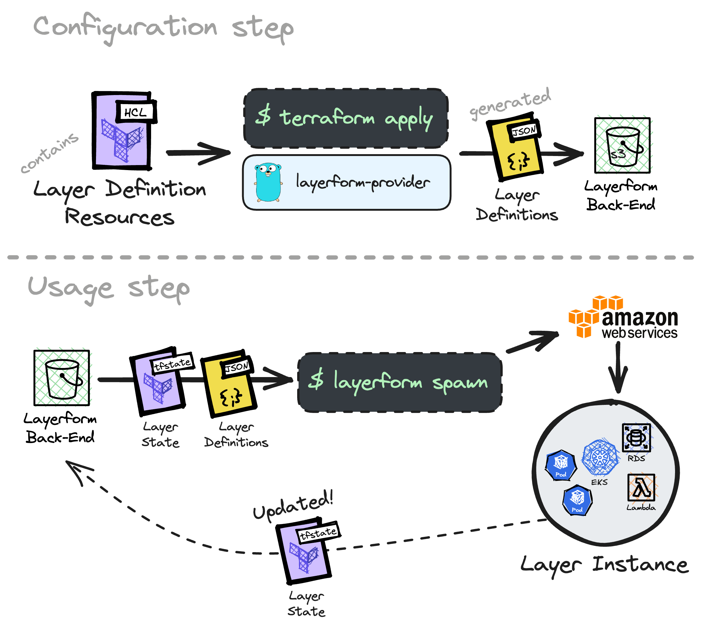

<div className="flex justify-center items-center">
    
</div>

In this page, you will learn about the terms we'll using in the rest of this documentation.

Here, you will understand what is a _layer definition_, a _layer instance_, a _Layerform back-end_, and the Layerform provider.



<Note>
    Layerform builds on top of Terraform. If you're not familiar with
    Terraform-related concepts, like `resources`, `data sources`, and
    `providers`, we'd recommend [reading about
    that](https://www.terraform-best-practices.com/key-concepts).
</Note>

## Layer definition

You can think of layer definition as "classes" from object-oriented programming. Each layer definition can yield a layer instance of that type.

Each layer definition has a name, a list of terraform files belonging to that layer, and a list of dependency layers.

These dependency layers are the layers upon which instances of this layer definition will be placed.

For example, you can have a layer definition for Kubernetes and a layer definition for your application. Your application's layer depends on the Kubernetes layer, and each of them has a different set of terraform files.

## Layer instance (or layer)

A layer instance is an instance of a layer definition.

Whenever you `layerform spawn` a layer, Layerform downloads a layer definition object and applies the Terraform files belonging to that layer to create a brand new pieces of infrastructure.

Each layer instance has a unique ID, and may be placed on top of other layer instances, which we call _dependencies_. These dependencies are other layer instances previously specified as dependencies for in this layer's definition.

## Layerform back-end

A layerform back-end stores layer definitions and the state for layer instances.

An S3 back-end, for example, is just an S3 bucket where Layerform will store layer definitions and the state of instances it applies.

Back-ends exist so that Layerform knows where to pull definitions and pieces of state from. Remote back-ends, like S3, help teams share layer definitions and the state of their development infrastructure.

## Layerform provider

The Layerform provider helps users provision a back-end with layer definitions. It's just a plain Terraform provider.

A team may use an S3 bucket to store layer definitions, for example. In that case, they'll configure the Layerform provider in their Terraform files to use that bucket as the back-end.

```hcl
# In a Terraform file
terraform {
  required_providers {
    layerform = {
      source  = "ergomake/layerform"
      version = "~> 0.1"
    }
  }
}

provider "layerform" {
  backend = "s3"
  bucket = "my-unique-bucket"
}
```

## Layer definition resource

A layer definition resource is a Terraform resource provided by the Layerform provider.

Each layer definition, named `layerform_layer_definition`, determines the layer definition's name, its files, and the layers upon which instances will depend.

```hcl
resource "layerform_layer" "base_layer" {
  name   = "base"
  files = ["./base_layer/**"]
}

resource "layerform_layer" "services_layer" {
  name   = "services"
  files = ["./services_layer/**"]
  dependencies = [
    layerform_layer.base_layer.id
  ]
}
```
