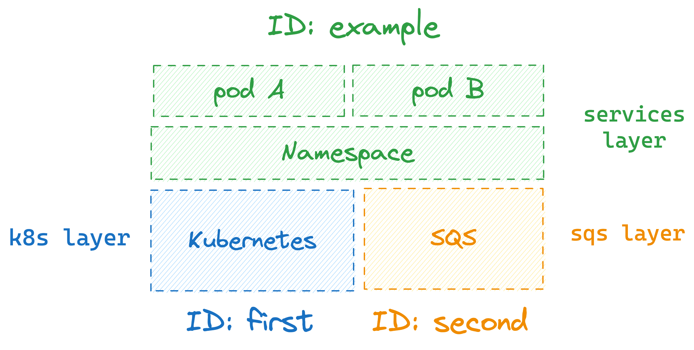

<div className="flex justify-center items-center">
    
</div>

Whenever an engineer wants to create an environment for themselves, they `spawn` a layer instance. That layer instance is based off of a layer definition previously provisioned to [a Layerform back-end](./backends).

Once an engineer is done using an environment, they can `kill` their environment so it stops consuming resources and incurring charges.

## Spawning layer instances

To spawn a layer instance you must use the `layerform spawn` command. This command takes the name of the layer definition to use, and the ID you want to assign to the new layer instance.

For example, if you want to create an instance of your `services` layer and assign it an ID of `my-dev`, you can run `layerform spawn services my-dev`.

### Default underlying layers

By default, whenever you spawn a layer instance which has dependencies, Layerform will look for dependencies whose ID is `default` to use as underlying layers.

If a dependency whose ID is `default` does not exist, Layerform will create one.

### Specifying which underlying layers to use

You can also specify a particular base layer instance to run your new instance on top. For that, you must use the `--base` flag when running `layerform spawn`.

This flag takes a list of layer definition names and IDs.

Assume you have a `services` layer that depends on `k8s` and `sqs` layers, for example. In that case, you can tell `layerform` to use the `k8s` layer instance whose ID is `first` by running the command below.

```
$ layerform spawn services example --base "k8s=first"
```

That command will run the `example` layer for `services` on top of the `k8s` layer instance whose id is `first`. It will also use the `sqs` layer instance whose ID is `default` because an ID was not specified for `sqs`.


To specify an ID for both the `k8s` and `sqs` layers, use `k8s=first,sqs=second` as an argument to `--base`, as shown in the command below.

```
$ layerform spawn services example --base "k8s=first,sqs=second"
```

This command will cause Layerform to use the instance for `k8s` whose ID is `first` and the instance for `sqs` whose ID is `second`.



<Note>
    Whenever an underlying layer instance with the specified ID does not exist,
    Layerform will create that instance using the ID you specified.
</Note>

## Killing layer instances

To kill a layer instance, you can run `layerform kill` followed by a layer definition name and the ID of the layer instance you want to destroy.

Assume you want to destroy an instance of the `services` layer definition whose ID is `my-instance`, for example. In that case, you could run `layerform kill services my-instance`.

### Killing layers with dependants

You can't kill instances which have dependants running on top of them.

Assume you have an instance of `services` whose ID is `services-example` running on top of a `base` layer whose ID is `base-example`. In that case, running `layerform kill base base-example` will cause an error.

The only way to kill the `base-example` instance of `base` is to kill the `services-example` layer first.

```
$ layerform kill services services-example

# Now you can kill the base layer
$ layerform kill base base-example
```
