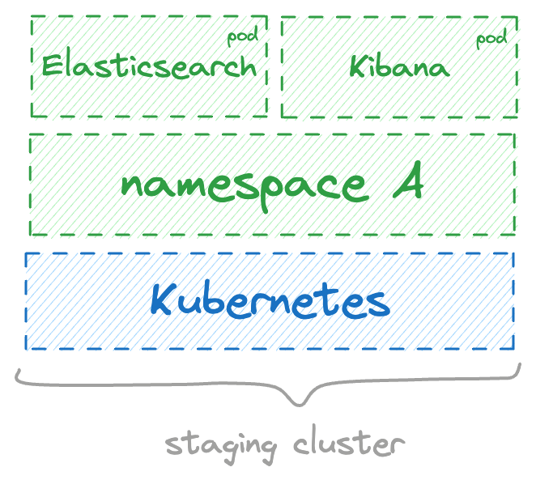
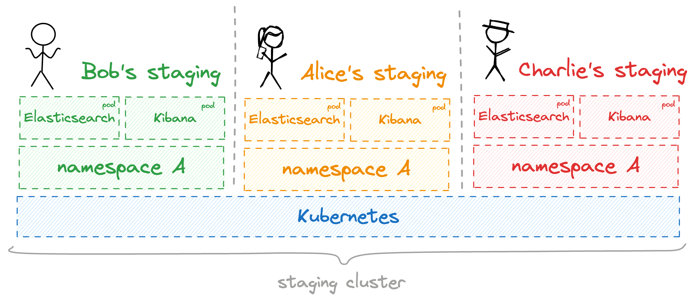
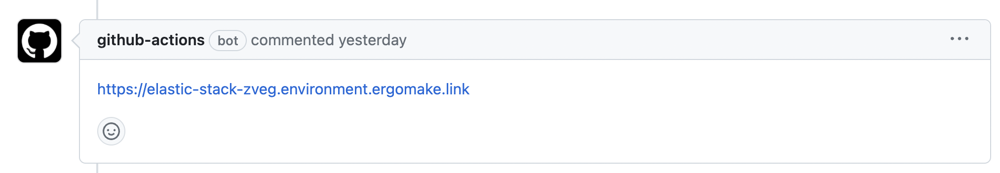

    

In this tutorial, you'll learn how to set up development infrastructure for an Elastic Stack instance (Elasticsearch and Kibana) which runs on top of a shared Kubernetes cluster for development.

In this tutorial, you'll learn how to:

1. Create layer definitions for your Kubernetes cluster and the Elastic Stack.
2. Provision your back-end with these layer definitions for the rest of the team to use.
3. Create your own development infrastructure using the layer definitions provisioned in the previous step.

By the end of this tutorial, each developer in your team should be able to create their own instances of Elasticsearch and Kibana on top of a shared Kubernetes cluster.

## Why would I want to use layers for that?

Assume you work at a company developing products on top of Elasticsearch.

In most companies, you'd have a single "staging" environment with a large Kubernetes cluster and an instance of Elasticsearch and Kibana.

Whenever a developer in your company wants to test a new feature, they'd have to merge their code to `main` and deploy it to "staging" so they could test it in a production-like environment. Then, if there are bugs, developers would have to rush and do a lot of rework to fix `main`, which would now be broken.

Even if developers can deploy to "staging" _before_ merging code, usually there will be a confusing Slack channel in which everyone fights for a time slot to use "staging".

Additionally, developers' machines may not be powerful enough to run minikube, the whole Elastic Stack, and your own services. Consequently, developers will all point to the same "staging", causing all sorts of weird bugs as their changes will interfere with one another.

Workers, for example, would be a nightmare because developers' workers would be competing with each other to pick up messages from a queue.

That's not to mention all the problems related with residual and messy data that will remain in `staging`.

**Layerform solves all of these problems by allowing each developer to create their own "staging"**. In each "staging", developers would have their own Elastic Stack, and any other services they may need. That way, developers' changes and tests won't interfere with one another.

Additionally, you could use Layerform within a GitHub workflow to generate preview links for each of your pull requests. These previews support _any_ infrastructure, and can run on top of a shared Kubernetes cluster.

<Note>
    For more details on layer use-cases, see [this
    document](https://github.com/ergomake/layerform/blob/main/blog/breaking-terraform-into-layers.md).
</Note>
