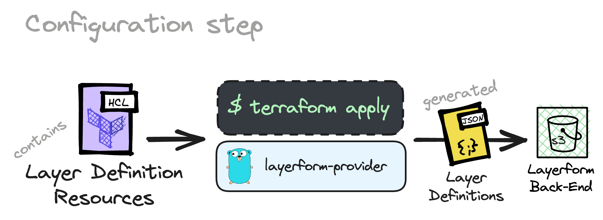
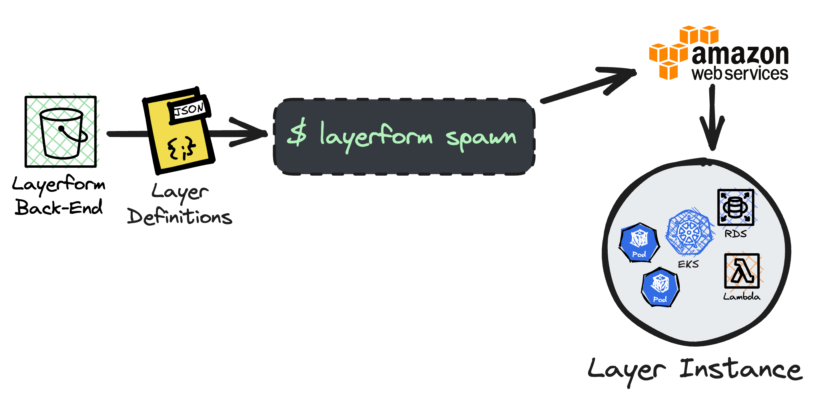

<div className="flex justify-center items-center">
    
</div>

In this page you'll learn what it means to "provision" a Layerform back-end and how to provision an S3 bucket with layer definitions. That way, everyone in your team will be able to use your layer definitions to spin up environments.

## What is "provisioning"?

Every time you _provision_ a Layerform back-end, you'll upload a `json` file containing the name of each layer, its dependencies and contents (Terraform files). The term _provisioning_ refers to the act of uploading the definition file and the Terraform files it refers to.



In the previous part of this tutorial, you have already provisioned a local Layerform back-end with layer definitions. In that case, you used the `local` back-end (your filesystem) to store the `json` file with the layer definitions.

The problem with using the `local` back-end to store layer definitions is that you're the only one who can use those definitions to create an environment. If you want _everyone_ in your team to be able to use your layer definitions, you must use a remote back-end, like an S3 bucket.



## Provisioning an S3 bucket

To define layers, you should create a `layers.json` file and use the format below.

```json
{
    "layers": [
        {
            "name": "base_example",
            "files": ["layers/base.tf", "layers/base/**"]
        },
        {
            "name": "your_top_layer",
            "files": ["layers/example.tf", "layers/example/**"],
            "dependencies": ["base_example"]
        }
    ]
}
```

After creating a JSON file like this, configure the Layerform CLI to use a remote S3 bucket by writing to the `config.yml` file in the `~/.layerform` directory.

```yaml
currentContext: example-context
contexts:
    example-context:
        type: s3
        bucket: layerform-bucket-example
        region: us-east-1
```

Now, run `layerform configure` to provision these layers to your S3 bucket.

<Warning>
Please create a bucket exclusively for Layerform when using an S3 bucket as a back-end.

Layerform should always have its own bucket for storing layer states and definitions. Otherwise, it may overwrite existing files.

</Warning>

Once you have configured the `layerform` provider to use an S3 bucket as back-end, every time you run `layerform configure` again, you'll update the layer definitions in the bucket.

Now, whoever uses `layerform spawn` to create a layer will use definitions within the S3 bucket. That way, you'll ensure everyone in the team is spawning the latest version of your layers, as long as they have the same config file.

<Note>
    Whenever you update a layer, you can run `layerform configure` again to
    update the definitions in the cloud's S3 bucket.
</Note>
