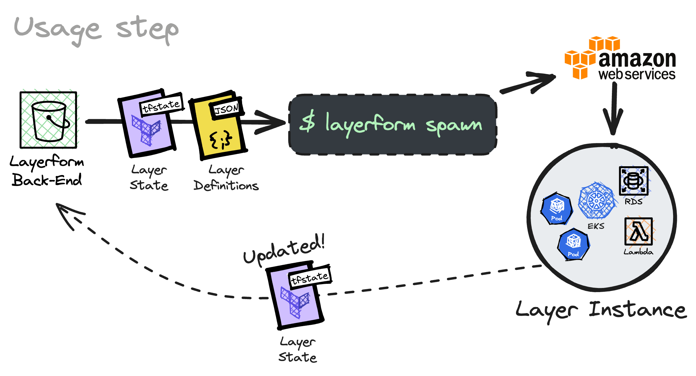

<div className="flex justify-center items-center">
    
</div>

In this page you'll learn what it means to "provision" a Layerform back-end and how to provision an S3 bucket with layer definitions. That way, everyone in your team will be able to use your layer definitions to spin up environments.

## What is "provisioning"?

Every time you _provision_ a Layerform back-end, you'll generate a `json` file containing the name of each layer, its dependencies and contents (Terraform files). The process of generating this file and moving it somewhere is called _provisioning_.


In the previous part of this tutorial, you have already provisioned a Layerform back-end with layer definitions. In that case, you used the `local` back-end (your filesystem) to store the `json` file with the actual layer definitions.

The problem with using the `local` back-end to store layer definitions is that you're the only one who can use those definitions to create an environment. If you want _everyone_ in your team to be able to use your layer definitions, you must use a remote back-end, like an S3 bucket.



## Using the JSON format

The official `layerform-provider` is not yet available. For now, you'll have to use the JSON format to configure layer definitions.

To define layers, you should create a `layers.json` file and use the format below.

```json
{
    "layers": [
        {
            "name": "your_layer_name",
            "files": [
                "layers/example.tf",
                "layers/example/main.tf",
                "layers/example/input.tf",
                "layers/example/output.tf",
                "layers/example/variables.tf"
            ],
            "dependencies": ["base_layer"]
        }
    ]
}
```

After creating a JSON file like this, configure the Layerform CLI using the `config.yml` file in the `~/.layerform` directory.

```yaml
currentContext: example-context
contexts:
    example-context:
        type: s3
        bucket: layerform-bucket-example
        region: us-east-1
```

Now, run `layerform configure` to provision these layers to your S3 bucket.

<Warning>
Please create a bucket exclusively for Layerform when using an S3 bucket as a back-end.

Layerform should always have its own bucket for storing layer states and definitions. Otherwise, it may overwrite existing files.

</Warning>

Once you have configured the `layerform` provider to use an S3 bucket as back-end, just run `terraform apply` again and you'll see that the configured bucket will now have a `json` file containing layer definitions.

Now, whoever uses `layerform spawn` to create a layer will use definitions within the S3 bucket. That way, you'll ensure everyone in the team is spawning the latest version of your layers, as long as they have the same config file.

<Note>
    Whenever you update a layer, you can run `layerform configure` again to
    update the definitions in the cloud's S3 bucket.
</Note>

## Provisioning an S3 bucket using the provider

<Warning>This feature is not publicly available yet.</Warning>

To provision an S3 bucket, you must update the Layerform provider configuration in your Terraform file to include the name of the bucket in which Layerform should store layer definitions.

```hcl
provider "layerform" {
    backend {
        type   = "s3"
        bucket = "layerform-bucket-example"
        region = "us-east-1"
    }
}

resource "layerform_layer_definition" "base_layer" {
  name   = "base"
  files = ["./eks.tf", "./eks/**"]
}

resource "layerform_layer_definition" "elastic_stack" {
  name   = "elastic_stack"
  files = ["./elastic_stack.tf", "./elastic_stack/**"]
  dependencies = [base_layer.name]
}
```
