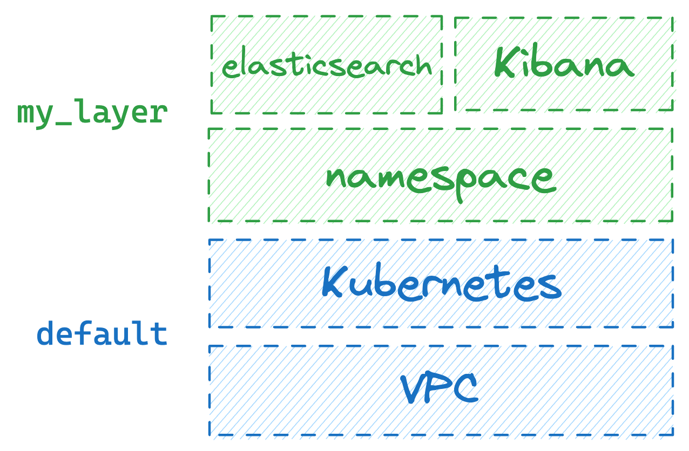
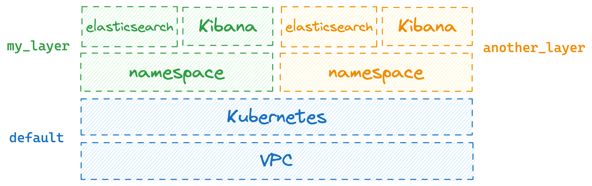
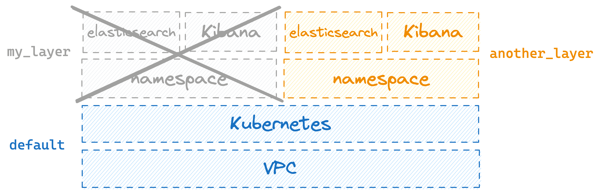
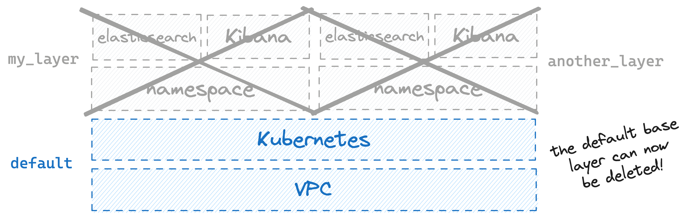

    

In this final part of the tutorial you'll learn how to run the dev infrastructure for your Elastic Stack.

## Running a brand new environment with an Elastic Stack

You can use `layerform spawn elastic_stack my_layer` to spawn an instance of the `elastic_stack` layer whose ID is `my_layer`.

Given the `elastic_stack` layer depends on an instance of the `base` layer, `layerform` will take care of spawning a new one for you because there are no existing instances of the `base` layer. Then, it'll spawn your `elastic_stack` layer.

When spawning the first instance of the `base` layer, it'll receive the name `default`, because no other instances of the `base` layer existed before.

Now, if someone else in the team wants to spawn Elasticsearch and Kibana instances, they can run `layerform spawn elastic_stack another_layer` to create an instance of `elastic_stack` whose ID is `another_layer`.

In that case, an instance of the `base` layer with ID `default` will already exist. Therefore, Layerform will spawn the `elastic_stack` layer on top of it.

<Note>
By default, Layerform will attempt to use underlying layers whose ID is `default`.

Whenever an underlying layer with ID `default` does not exist, Layerform will create one and apply the target layer on top of it.

</Note>

## Destroying environments

To destroy your environment, you can use `layerform kill elastic_stack my_layer`. This command will cause Layerform to tear down the instance of the `elastic_stack` layer whose ID is `my_layer`.

Now, see what happens when you try to destroy the `base` layer when there's still `another_layer` on top of it. If you try to do that by running `layerform kill base default` you'll see an error.

That error happens because you can only destroy a layer instance when no other instances depend on it.

To actually destroy the `base` layer with ID `default`, you must first destroy `another_layer` running `layerform kill elastic_stack another_layer`.

Only then you can run `layerform kill base default`.

## Using layers within a team

To use layers within a team, you must ensure that everyone in your team has configured their Layerform CLI to use the same back-end. That way, everyone will pull definitions from the same back-end. Additionally, they'll upload layer states there so that everyone in the team can see which layers exist.

For that, make sure to tell everyone to update their `~/.layerform/config` file and use the same back-end. Make sure to also give everyone permissions to read and write from that bucket, and [have their AWS credentials configured in their machines](https://docs.aws.amazon.com/cli/latest/userguide/cli-chap-configure.html).
