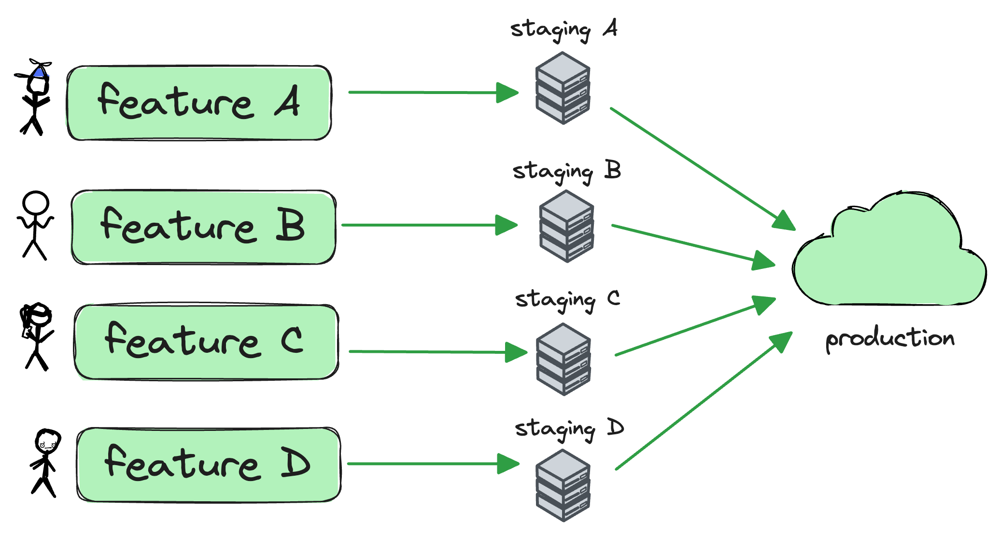

    

## The problem

Most companies have a single or too few "staging" environments. Therefore, engineers scramble to see who will use staging or end up merging changes without ever testing them in a production-like environment. Consequently, bugs slip, and there's a lot of rework to rollback changes and apply fixes after broken code has been merged.

Additionally, when systems are too big or too difficult to run locally, developers point their local applications to the only "staging" environment that exists. Sharing this single "staging" environment causes all sorts of weird behaviour because developers' changes will interfere with one another. Furthermore, when "staging" is broken, no one can write any code.

## The solution

**Layerform solves these problems by allowing each engineer to spin up their own "staging"**. That way, engineers have a production-like environment in which they can test changes before merging any code.

Engineers can also point their local applications to their own development infrastructure when writing code. That way, they won't interfere with one another's changes and won't be blocked if "staging" stops working.

## Why layers?

Layers make it easy for engineers to create their own development environments while sharing core-pieces of infrastructure.

When using Layerform, engineers can encapsulate different types of development environments into layers, and each engineer can spin up the layers they need for developing and testing their applications.

Additionally, Layerform helps you:

-   Understand the costs of each layer
-   Use terraform to spin-up development environments instead of using error-prone in-house solutions
-   Automatically turn-off environments after business hours or when they become inactive

## Symptoms indicating you should use layers

-   You have a Slack channel in which developers fight for time slots to use `staging`
-   You have created multiple pre-production environments (like `dev` or `sandbox`) in an attempt to avoid breaking `staging`
-   You struggle to run all of your services in your machine
-   Your developers write code pointing their local applications to `staging`
-   You can't deploy code to production once it's gone into `main` because you haven't tested it in a production-like environment before
-   You spend a lot of money maintaining a complex and suboptimal in-house system for deploying development infrastructure
